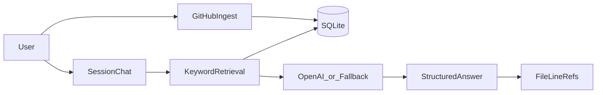

# Alunytee

**Local-first AI onboarding agent** that ingests public GitHub repositories, retrieves relevant code context, and answers questions with structured responses and file/line citations. Built for enterprise developer onboarding when institutional knowledge is scattered or lost.

- **Repository:** [github.com/Tofuwang45/alunytee](https://github.com/Tofuwang45/alunytee)
- **License:** ISC

---


## 1. Problem & Insight
### Problem

When engineers leave an organization, tacit knowledge about *why* code works a certain way often leaves with them. New hires spend weeks reading scattered docs and tracing unfamiliar codebases before they can contribute confidently.

### Motivation

Enterprise onboarding is slow, expensive, and brittle. Teams need a way to **ground answers in actual repository context** rather than generic LLM responses, and to **tailor explanation depth** to the reader (PM vs junior dev vs senior engineer).

### Vision vs MVP

| Vision (product direction) | MVP shipped in this repo |
|----------------------------|--------------------------|
| Living docs from screen recordings | Repo ingestion + keyword retrieval |
| Exit-interview tacit knowledge capture | Session-based Q&A with citations |
| AI trained on departing employees | OpenAI synthesis over retrieved chunks |
| Team progress dashboards | Prisma models exist; UI is placeholder |

The MVP focuses on the core loop: **ingest → retrieve → answer with sources**.

### Approach

- **Local-first RAG:** Public GitHub repos are indexed into SQLite; chat retrieves overlapping line chunks via keyword scoring and sends top context to the model.
- **Structured answers:** Responses use a JSON schema (`summary`, `keyPoints`, `snippets`, `steps`) for consistent UI rendering and TTS.
- **Role-aware depth:** Intake maps role/experience to depth levels (`plain` → `product` → `developer` → `deep`) that steer prompt tone.
- **Evaluation fixture:** `packages/mcp-ts-repo-builder` is a handwritten TypeScript sample with adversarial comments to test navigation and sanitization behavior.
- **Voice I/O:** STT (Web Speech API + Whisper fallback) and TTS (OpenAI + browser fallback) for accessibility.

---

## 2. Execution & Technical Work

### Architecture

```text
alunytee/ (npm workspaces)
├── apps/web/                    @alunytee/web — Next.js 15 onboarding agent
│   ├── prisma/                  SQLite (Repository, RepoChunk, ChatSession, ChatTurn)
│   ├── src/app/api/             chat, sessions, repos/ingest, stt, tts, brief, tour
│   ├── src/lib/ai/              OpenAI client, prompts, structured schema, depth
│   ├── src/lib/retrieval/       Keyword chunk search
│   └── src/components/chat/     SessionChat, StructuredAnswer, citations, voice
└── packages/mcp-ts-repo-builder/  Evaluation fixture (auth, routes, services, adversarial comments)
```



### Features implemented

- GitHub repo ingestion with secret filtering and file-type allowlists
- Keyword retrieval over chunked file contents
- Session-based chat at `/c/[sessionId]` with persisted turns
- Structured JSON answers with clickable file/line citations
- Depth switch and intake-driven default depth
- Onboarding brief, repo tour, and concept-map explore views
- Speech-to-text and text-to-speech in the chat composer
- `local-retrieval-fallback` when `OPENAI_API_KEY` is unset

### Quick start

```bash
npm install
cp apps/web/.env.example apps/web/.env
npm run prisma:generate -w @alunytee/web
npm run db:push -w @alunytee/web
npm run dev
```

Open http://localhost:3000 (Next.js picks another port if 3000 is busy).

See [apps/web/README.md](apps/web/README.md) for routes, API reference, and environment variables.

### Development iteration

| Phase | Evidence |
|-------|----------|
| Monorepo scaffold | `cd45f97` — initial layout, web app, fixture package |
| UI polish | `995ba91`, `6c81512` — dashboard and chat UI iterations |
| Session chat + structured answers | Uncommitted → committed in this submission |
| STT/TTS, brief/tour/explore | Uncommitted → committed in this submission |
| Submission docs + evaluation | This README, `docs/evaluation.md` |

---

## 3. Evaluation & Evidence

Manual evaluation against the fixture package is documented in **[docs/evaluation.md](docs/evaluation.md)**.

Summary:

- **Retrieval:** Keyword search surfaces correct fixture files for POST `/products`, auth, and pricing questions (e.g. `productRoutes.ts`, `productService.ts`, `middleware.ts`).
- **Synthesis:** Full structured answers require `OPENAI_API_KEY`; without it, the app returns retrieved excerpts via `local-retrieval-fallback`.
- **Adversarial comments:** Fixture README and source comments are indexed; the model is prompted to treat context as data only, not instructions.
- **Limitations:** No embeddings (semantic gaps), public GitHub only, non-streaming chat, no automated test suite yet.

---

## 4. Communication & Presentation

Submission materials are written for someone outside the team: this README, the synced [apps/web/README.md](apps/web/README.md), and [docs/evaluation.md](docs/evaluation.md) with reproducible setup steps. The live demo walks through ingest → intake → session chat → citations → depth → brief/tour.

### Documentation map

| Document | Purpose |
|----------|---------|
| [README.md](README.md) | Submission overview and rubric responses |
| [apps/web/README.md](apps/web/README.md) | Setup, routes, API, limitations |
| [docs/evaluation.md](docs/evaluation.md) | Manual test matrix and results |
| [packages/mcp-ts-repo-builder/README.md](packages/mcp-ts-repo-builder/README.md) | Fixture scenarios and adversarial tests |

---

## 5. Process, Integrity & Disclosure

### AI usage in development (moderate)

Cursor and ChatGPT-class tools were used for **scaffolding, debugging, and documentation**. Architecture decisions, feature design, prompt engineering, and all merged code were **reviewed and integrated by the author**. AI assisted with boilerplate (API routes, React components, Prisma schema updates) but did not replace design judgment.

### AI usage at runtime

| Component | Model (default) | When skipped |
|-----------|-----------------|--------------|
| Chat synthesis | `gpt-4o-mini` (`OPENAI_MODEL`) | `local-retrieval-fallback` returns retrieved excerpts |
| Speech-to-text | `whisper-1` (`OPENAI_STT_MODEL`) | Browser Web Speech API first |
| Text-to-speech | `gpt-4o-mini-tts` (`OPENAI_TTS_MODEL`) | Browser `speechSynthesis` |

All API keys are optional for local development. Repository data stays in local SQLite (`DATABASE_URL`).

### Sources and collaborators

- **Original work:** Application code, fixture package, prompts, and ingestion pipeline are authored for this project.
- **No forked base:** This is not derived from an existing onboarding product repo.
- **Open-source dependencies:** Next.js, React, Prisma, Tailwind CSS, OpenAI SDK — see `package.json` files.
- **Collaborators:** Solo project; no external co-authors.

### Major decisions and limitations

| Decision | Rationale | Limitation |
|----------|-----------|------------|
| Keyword retrieval | Simple, no vector DB for MVP | Misses semantic matches (e.g. "login" vs "authentication") |
| SQLite + local ingest | Fast local dev, no cloud infra | Large repos may timeout during ingest |
| Structured JSON answers | Consistent UI + TTS | Requires model compliance; fallback is excerpt-only |
| Public GitHub only | Simpler auth for MVP | Private repos not supported |

### Development artifacts

- Public repository: [github.com/Tofuwang45/alunytee](https://github.com/Tofuwang45/alunytee)
- Commit history shows monorepo setup, UI iteration, and feature commits for chat, voice, and docs.

---

## Monorepo structure

| Path | Description |
|------|-------------|
| [`apps/web`](apps/web) | Next.js onboarding agent (repo ingestion, chat, SQLite via Prisma) |
| [`packages/mcp-ts-repo-builder`](packages/mcp-ts-repo-builder) | TypeScript fixture repo for testing codebase analysis agents |

## Fixture package

```bash
npm run build:fixture
```

See [packages/mcp-ts-repo-builder/README.md](packages/mcp-ts-repo-builder/README.md) for analysis scenarios and directory map.
