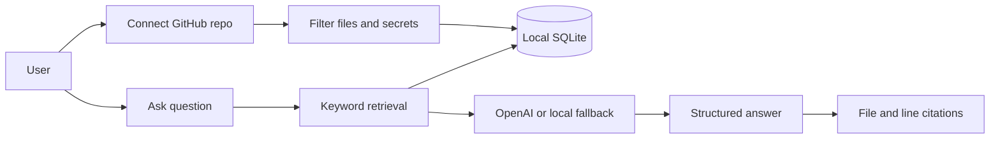

# Alunytee

**Alunytee is a local-first AI onboarding agent for understanding unfamiliar codebases.** It ingests a public GitHub repository, stores the useful source files locally, retrieves the most relevant code when someone asks a question, and answers with structured explanations plus file and line citations.

The project is designed around a common enterprise problem: new engineers often inherit systems whose context lives in old pull requests, scattered docs, or the heads of people who have already left. Alunytee turns the repository itself into the starting point for onboarding, so answers are grounded in real code instead of generic model memory.

- **Repository:** [github.com/Tofuwang45/alunytee](https://github.com/Tofuwang45/alunytee)
- **License:** ISC

---

## What It Solves

When an engineer joins a team, the hardest part is often not reading syntax. It is understanding the reasoning behind routes, services, data models, and trade-offs. Traditional documentation helps only when it is complete and current, which is rarely true in fast-moving teams.

Alunytee focuses on the first useful onboarding loop:

1. Connect a public GitHub repository.
2. Index the code into local SQLite storage.
3. Ask questions in a chat session.
4. Retrieve relevant code chunks.
5. Generate an answer with citations back to the repository.

This MVP does not try to replace all team knowledge. Instead, it proves a narrower idea: if the system can reliably connect a question to the right files and line ranges, it can become a practical assistant for new hires, PMs, and engineers exploring unfamiliar code.

## Product Direction vs MVP

The long-term vision is a richer onboarding platform that could combine repository analysis, exit-interview knowledge capture, screen recordings, progress tracking, and team dashboards. The shipped MVP focuses on the technical core needed before those larger workflows are useful.

| Product direction | MVP shipped in this repo |
|-------------------|--------------------------|
| Living documentation from recordings and docs | Repository ingestion and code chunking |
| Tacit knowledge capture from departing employees | Session-based Q&A over repository context |
| AI tuned to a team's internal knowledge | OpenAI synthesis over retrieved local chunks |
| Team onboarding progress dashboards | Prisma models exist; UI is still placeholder |

In short: the product vision is institutional memory, while the MVP is the retrieval and answer engine that memory would depend on.

---

## How It Works

Alunytee uses a local-first RAG flow. RAG stands for retrieval-augmented generation: before asking the model to answer, the app retrieves relevant source material and includes it as context.



The flow is intentionally simple:

- **Ingestion** fetches a public GitHub repository, skips generated or unsafe files, and stores useful text/code files.
- **Chunking** splits files into overlapping line-based chunks so answers can cite specific regions instead of whole files.
- **Retrieval** scores chunks with keyword matching and selects the strongest context for a question.
- **Synthesis** sends retrieved context to OpenAI when an API key is configured.
- **Fallback mode** still returns retrieved excerpts and references when no OpenAI key is available.
- **Structured rendering** keeps answers consistent across the UI, citations, and text-to-speech.

---

## Repository Layout

```text
alunytee/ (npm workspaces)
├── apps/web/                       Next.js 15 onboarding agent
│   ├── prisma/                     SQLite schema and Prisma client setup
│   ├── src/app/api/                API routes for ingest, chat, sessions, STT, TTS, brief, tour
│   ├── src/lib/ai/                 OpenAI client, prompts, schema, and depth logic
│   ├── src/lib/retrieval/          Keyword chunk search
│   └── src/components/chat/        Chat UI, structured answers, citations, voice controls
└── packages/mcp-ts-repo-builder/   TypeScript fixture repo for evaluation scenarios
```

The web app is the main product. The fixture package is a small handwritten TypeScript codebase used to test whether the agent can navigate routes, services, auth middleware, pricing logic, and adversarial comments.

---

## Features

### Repository ingestion

Users can submit a public GitHub URL. The app reads repository metadata and the recursive file tree, then indexes allowed source files. It skips dependency folders, generated files, lockfiles, binary files, oversized files, env-like files, and files that appear to contain secrets.

This keeps the local index useful while reducing the chance of storing noisy or sensitive content.

### Local storage

Indexed repository data is stored in SQLite through Prisma. This keeps the MVP easy to run locally and avoids requiring cloud infrastructure or a hosted vector database.

The main stored concepts are repositories, files, chunks, chat sessions, and chat turns.

### Retrieval-based chat

Chat sessions live at `/c/[sessionId]`. When a user asks a question, the app retrieves the most relevant chunks and attaches file paths, line ranges, and scores. The answer can then point back to the exact code that informed it.

This is the core behavior that makes the assistant useful for onboarding: a user can ask "Where is product creation handled?" and receive both an explanation and citations to implementation files.

### Structured answers

Model responses are shaped into a JSON structure with:

- `summary` for the direct answer
- `keyPoints` for the main takeaways
- `snippets` for cited code examples
- `steps` for procedures or flows

The UI renders this structure consistently, and the same structure can be converted into readable text for speech output.

### Role-aware depth

The app supports explanation depth levels:

| Level | Intended reader |
|-------|-----------------|
| `plain` | Non-technical reader who wants minimal jargon |
| `product` | PM or cross-functional teammate focused on behavior and user impact |
| `developer` | Engineer who needs implementation detail |
| `deep` | Senior engineer reviewing architecture and trade-offs |

The onboarding intake maps a user's role and experience to a default depth, and the chat UI lets the user switch depth during a session.

### Voice input and output

The chat composer supports speech-to-text and text-to-speech:

- STT uses the browser Web Speech API first, then can fall back to OpenAI Whisper.
- TTS uses OpenAI audio when configured, otherwise browser `speechSynthesis`.

This makes the experience more accessible and supports users who prefer talking through unfamiliar code.

### Brief, tour, and explore views

Beyond chat, the app includes early versions of onboarding views:

- `/repos/[repoId]/brief` summarizes a repository for onboarding.
- `/repos/[repoId]/tour` gives a guided walkthrough.
- `/repos/[repoId]/explore` provides a concept-map style exploration view.

These views show where the product can grow after the retrieval and chat loop is solid.

---

## Quick Start

From the monorepo root:

```bash
npm install
cp apps/web/.env.example apps/web/.env
npm run prisma:generate -w @alunytee/web
npm run db:push -w @alunytee/web
npm run dev
```

Open [http://localhost:3000](http://localhost:3000). If port 3000 is busy, Next.js will print the alternate local port.

For a fuller setup guide, routes, API details, and environment variables, see [apps/web/README.md](apps/web/README.md).

## Environment Notes

All OpenAI keys are optional for local development.

| Variable | Purpose |
|----------|---------|
| `OPENAI_API_KEY` | Enables synthesized structured answers, Whisper STT, and OpenAI TTS |
| `OPENAI_MODEL` | Overrides the default chat model |
| `OPENAI_STT_MODEL` | Overrides the default speech-to-text model |
| `OPENAI_TTS_MODEL` | Overrides the default text-to-speech model |
| `GITHUB_TOKEN` | Optional for public repos, useful for avoiding GitHub rate limits |
| `DATABASE_URL` | Points Prisma to the local SQLite database |

When `OPENAI_API_KEY` is not set, chat uses `local-retrieval-fallback`. That fallback does not synthesize a full answer, but it still proves that ingestion, retrieval, and citations are working.

---

## Evaluation

Manual evaluation is documented in [docs/evaluation.md](docs/evaluation.md). The test repo is the included `packages/mcp-ts-repo-builder` fixture, which contains realistic TypeScript files and intentionally adversarial comments.

The evaluation checks whether Alunytee can:

- retrieve the right files for product route, service, auth, and pricing questions
- return real file paths and line ranges
- degrade gracefully without an OpenAI key
- support depth-aware answers when model synthesis is available
- treat suspicious comments as repository data rather than instructions

Current results show that the retrieval pipeline works best when query terms overlap the code. For example, targeted questions about product routes and pricing surface `productRoutes.ts` and `productService.ts`. Broader natural-language questions can miss related files because retrieval is currently keyword-based rather than semantic.

That limitation is useful evidence for the next technical step: embeddings or hybrid retrieval.

---

## Development Timeline

| Phase | Evidence |
|-------|----------|
| Monorepo scaffold | `cd45f97` — initial layout, web app, fixture package |
| UI iteration | `995ba91`, `6c81512` — dashboard and chat UI improvements |
| Session chat and structured answers | Added for this MVP submission |
| Voice, brief, tour, and explore views | Added for this MVP submission |
| Submission documentation and evaluation | This README and [docs/evaluation.md](docs/evaluation.md) |

## Design Decisions

| Decision | Why it was chosen | Trade-off |
|----------|-------------------|-----------|
| Keyword retrieval | Simple, transparent, fast to ship locally | Misses semantic matches such as "login" vs `requireAuth` |
| SQLite | Easy local setup with no cloud dependency | Not ideal for large multi-team deployments |
| Public GitHub only | Keeps authentication simple for the MVP | Private enterprise repos need future OAuth work |
| Structured JSON answers | Makes UI rendering and TTS predictable | Depends on model compliance when OpenAI is enabled |
| Synchronous ingestion | Simpler MVP implementation | Large repositories can time out |

---

## Known Limitations

- Retrieval is keyword-based, not embeddings-based.
- Only public GitHub repositories are supported.
- Ingestion runs inside the request lifecycle.
- Chat responses are non-streaming.
- The progress dashboard is modeled but not fully implemented.
- Automated regression tests are not yet included.
- Full adversarial-comment behavior still needs evaluation with `OPENAI_API_KEY` enabled.

## Future Improvements

- Background ingestion jobs for larger repositories
- Embeddings or hybrid retrieval for better semantic matching
- Private GitHub repository support through OAuth
- GitLab support
- Generated onboarding paths, quizzes, and grading
- Team progress dashboards
- Slack, Jira, Linear, and internal docs ingestion
- SSO, RBAC, audit logs, and multi-tenant workspaces

---

## Process and Disclosure

### AI usage during development

Cursor and ChatGPT-class tools were used in a moderate way for scaffolding, debugging, and documentation support. Architecture decisions, feature design, prompt engineering, and code integration were reviewed and directed by the author.

AI helped with implementation speed, but the project was not copied from an existing onboarding product or forked base.

### Runtime AI usage

| Component | Default model | Fallback |
|-----------|---------------|----------|
| Chat synthesis | `gpt-4o-mini` via `OPENAI_MODEL` | `local-retrieval-fallback` with retrieved excerpts |
| Speech-to-text | `whisper-1` via `OPENAI_STT_MODEL` | Browser Web Speech API first |
| Text-to-speech | `gpt-4o-mini-tts` via `OPENAI_TTS_MODEL` | Browser `speechSynthesis` |

Repository data stays in the local SQLite database configured by `DATABASE_URL`.

### Sources and collaborators

- **Original work:** Application code, fixture package, prompts, ingestion pipeline, and documentation were authored for this project.
- **No forked base:** The repo is not derived from an existing onboarding product.
- **Open-source dependencies:** Next.js, React, Prisma, Tailwind CSS, OpenAI SDK, and related packages listed in `package.json` files.
- **Collaborators:** Solo project; no external co-authors.

---

## Documentation Map

| Document | What it explains |
|----------|------------------|
| [README.md](README.md) | Project overview, motivation, architecture, evaluation, and disclosure |
| [apps/web/README.md](apps/web/README.md) | Web app setup, routes, API reference, features, and limitations |
| [docs/evaluation.md](docs/evaluation.md) | Manual test matrix, observed results, and next evaluation steps |
| [packages/mcp-ts-repo-builder/README.md](packages/mcp-ts-repo-builder/README.md) | Fixture scenarios for testing codebase analysis |

## Fixture Package

Build the TypeScript fixture package with:

```bash
npm run build:fixture
```

See [packages/mcp-ts-repo-builder/README.md](packages/mcp-ts-repo-builder/README.md) for the fixture's analysis scenarios and directory map.
